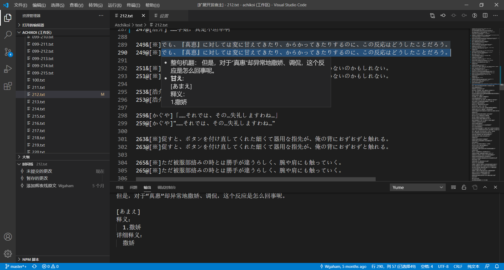
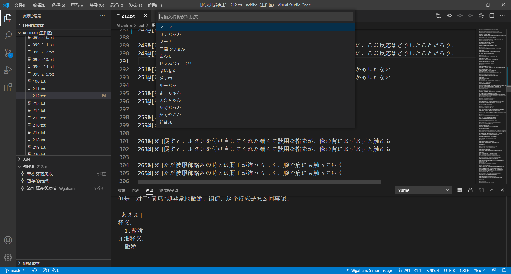
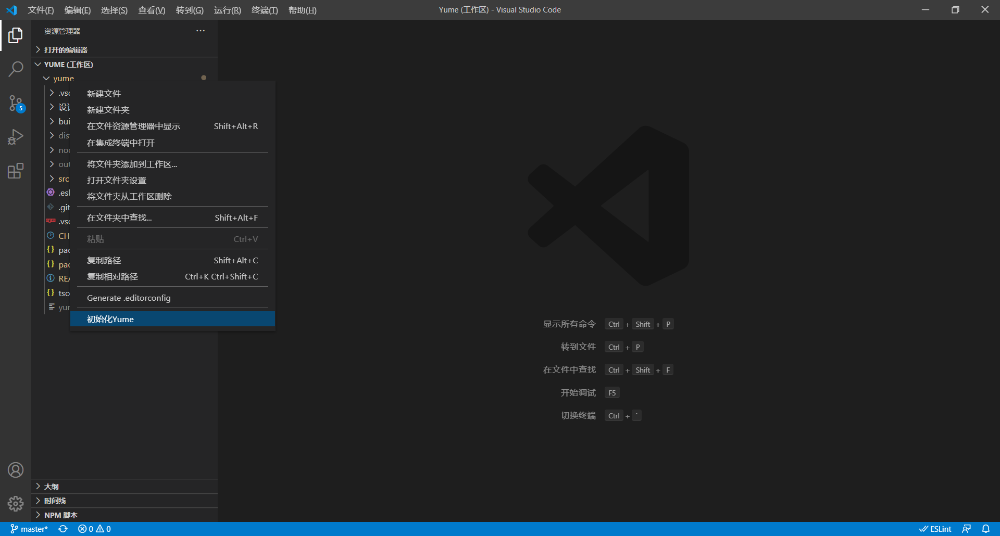
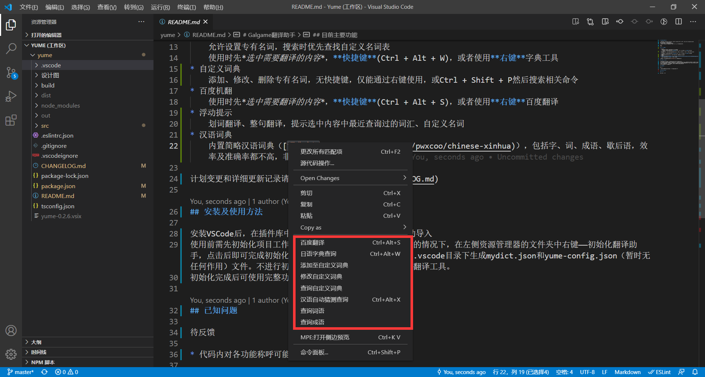
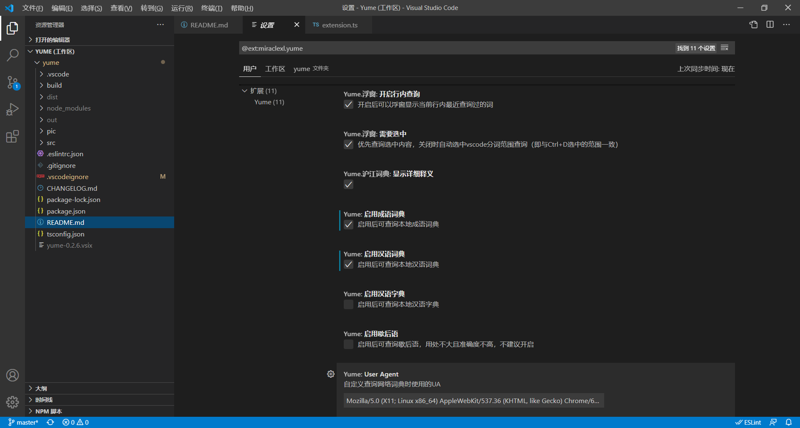

# Galgame翻译助手

原名Galgame Translator Assistant ~~(GTA)~~，后来和朋友讨论后改为 Yume (Your Unsophisticated Multifunctional Enlightenment)
~~(发布的时候中二病犯了，临时编的)~~

是否会持续更新待定，有需求的话看情况开发一个独立完整的翻译软件

目录

* [目前主要功能](#目前主要功能)
* [安装及使用方法](#安装及使用方法)
* [已知问题](#已知问题)
* Release Notes

## 目前主要功能

* 字典工具
    允许设置专有名词，搜索时优先查找自定义名词表
    使用时先*选中需要翻译的内容*，**快捷键**(Ctrl + Alt + W)，或者使用**右键**字典工具
* 自定义词典
    添加、修改、删除专有名词，无快捷键，仅能通过右键使用（添加需要选中原文），或Ctrl + Shift + P然后搜索相关命令
* 百度机翻
    使用时先*选中需要翻译的内容*，**快捷键**(Ctrl + Alt + S)，或者使用**右键**百度翻译
* 浮动提示
    划词翻译、整句翻译，提示选中内容中最近查询过的词汇、自定义名词
* 汉语词典
    内置简略汉语词典（[词典来源](https://github.com/pwxcoo/chinese-xinhua)），包括字、词、成语、歇后语，效率及准确率都不高，非必要建议在设置中关闭。

计划变更和详细更新记录请查阅[**更改日志**](CHANGELOG.md)

## 安装及使用方法

安装VSCode后，在插件库中搜索，或在发布链接中下载后手动导入
使用前需先初始化项目工作区，初始化操作可在打开有文件夹的情况下，在左侧资源管理器的文件夹中右键——初始化翻译助手，点击后即可完成初始化操作。

初始化会在当前文件夹中的.vscode目录下生成mydict.json和yume-config.json（暂时无任何作用）文件。不进行初始化仍可使用除自定义词典以外的翻译工具。
初始化完成后可使用完整功能。可右键或快捷键使用功能，其中百度机翻目前只实现了翻译至汉语，机翻和查词均需选中文字后才会出现在菜单，若未选中任何文字时使用快捷键，可以手动输入待查内容。

扩展设置页面可以修改UA、选择开启功能等

## 已知问题

待反馈

* 代码内对各功能称呼可能不同一，看到不对劲了再改

## Release Notes

### 1.0.0

正式发布第一版
